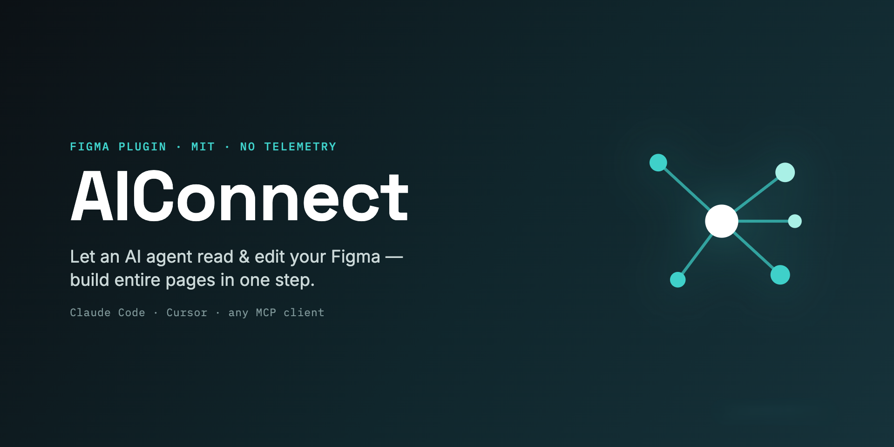
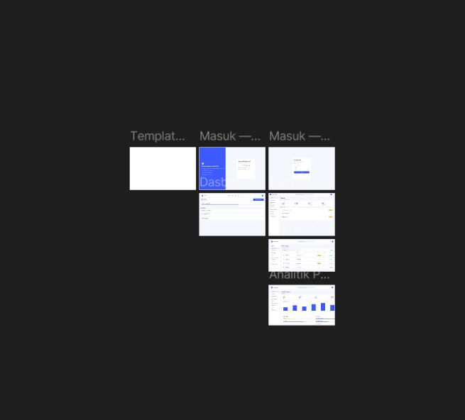
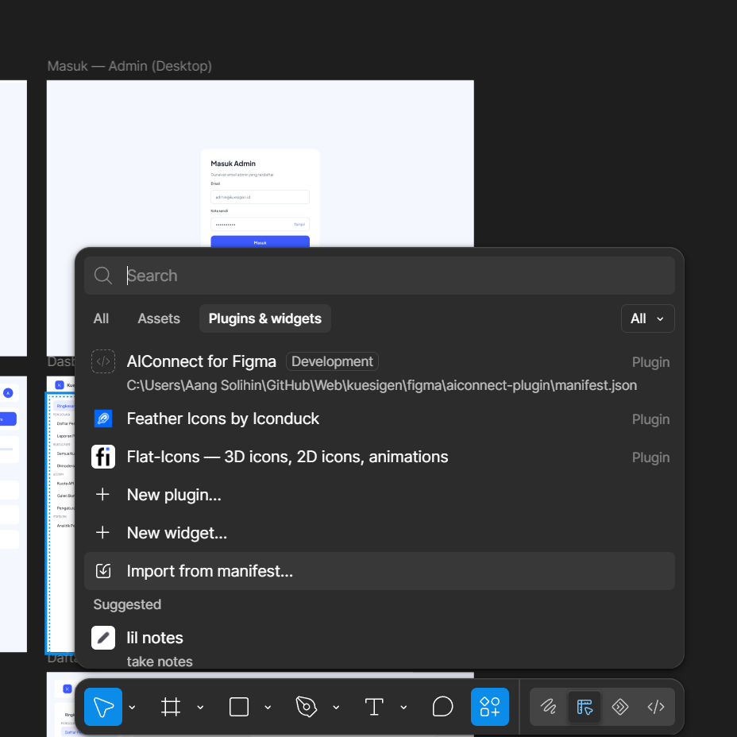
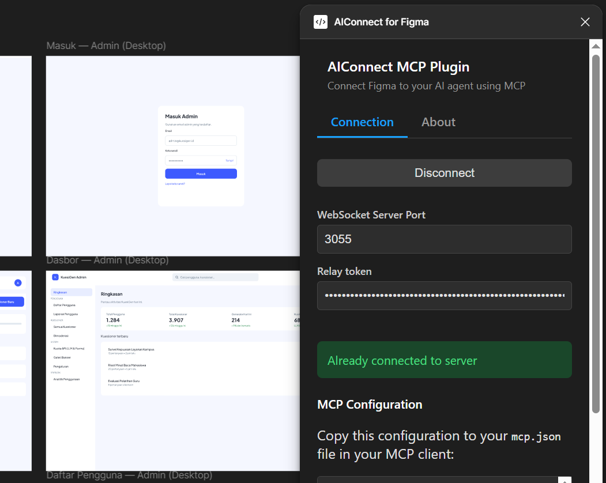

<div align="center">


# AIConnect for Figma

### Your AI agent, designing in your real Figma file — 100% local, whole pages in one call.

Open-source · fully local · no cloud, no telemetry · works with Claude Code, Cursor, or any MCP client.

[](https://www.npmjs.com/package/aiconnect-figma)
[](./LICENSE)
[](#-license)
[](https://modelcontextprotocol.io)
[](#why-aiconnect)
[](#)
[](#-contributing)
[](https://github.com/angslhn/aiconnect-figma-mcp)



</div>

**AIConnect is an MCP server + Figma plugin that hands your AI agent a real pen in your real Figma file.** It creates pages, frames, text, components and variants, auto‑layout, fills, gradients, effects, SVGs, styles, images, clones nodes, builds a full design‑token system, audits your layout grid, and **assembles entire pages in one round‑trip** with `batch_ops`. Everything runs on your machine and talks only to a relay on `localhost` — **no cloud, no telemetry, nothing leaves your laptop** (the only exceptions needing internet: `search_icons`/`insert_icon` via Iconify and `search_images` via Openverse).

> ⭐ If this saves you time, a star helps other people find it.

---

## ✨ See it in action

> No hand‑placed layers. An agent was asked to design a hard‑water hair‑care brand and built it all **directly in Figma** through AIConnect — a landing page, a product page, and four full design‑direction boards, each assembled with `batch_ops`.

<div align="center">

</div>

---

## 📖 Usage

There are **three pieces**: the MCP server (what the agent talks to), the Figma plugin (what edits the file), and the `localhost` relay between them (built into the server — nothing to run manually).

**Prerequisites:** [Node ≥ 18](https://nodejs.org) (or [Bun](https://bun.sh)) and the free **[Figma desktop app](https://www.figma.com/downloads/)** (the browser version can't import dev plugins).

### Option A · No clone — use `npx` (fastest)

Add this to your MCP client config (Claude Code: `.mcp.json`, Cursor: `mcp.json`):

```jsonc
{
  "mcpServers": {
    "AIConnect": {
      "command": "npx",
      "args": ["-y", "aiconnect-figma"],
    },
  },
}
```

`npx` always pulls the latest release from npm. Then continue to [step 3 (plugin)](#3--install-the-figma-plugin-once).

### Option B · From source (dev / hacking)

```bash
git clone https://github.com/angslhn/aiconnect-figma-mcp
cd aiconnect-figma
bun install && bun run build        # or: npm install && npm run build
```

Two build modes are available:

| Command                                                 | Output                                                                  | Good for                                                            |
| ------------------------------------------------------- | ----------------------------------------------------------------------- | ------------------------------------------------------------------- |
| `bun run build` / `npm run build`                       | `dist/server.js` + `dist/server.cjs` (needs `node_modules` alongside)   | dev, `npx`, npm publishing                                          |
| `bun run build:standalone` / `npm run build:standalone` | `dist-standalone/server.cjs` — **one file** (~900 KB, all deps bundled) | colocating with the plugin folder, portable paths, no `npm install` |

Then point your MCP client at the build output (absolute path):

```jsonc
{
  "mcpServers": {
    "AIConnect": {
      "command": "node",
      "args": ["/absolute/path/to/aiconnect-figma/dist/server.js"],
    },
  },
}
```

> Or run `./scripts/setup.sh` — it builds, writes a correctly-pathed `.mcp.json`, and prints the plugin steps. Idempotent, safe to re-run.

### 2 · Relay (nothing to do)

The MCP server hosts the `ws://localhost:3055` relay itself on startup (if the port is taken, it joins the existing relay instead). **There is no second process to run.** Only if you want one relay shared across several agents: `npx -y aiconnect-figma relay` (or `bun run relay`).

### 3 · Install the Figma plugin (once)

1. **[⬇️ Download `aiconnect-figma-plugin.zip`](https://github.com/angslhn/aiconnect-figma-mcp/releases/latest)** and unzip it — or import straight from source via `src/figma_plugin/manifest.json` (no download needed).
2. In the **Figma desktop app** (not the browser): menu → **Plugins → Development → Import plugin from manifest…** → pick the unzipped `manifest.json`.
3. Run **Plugins → Development → AIConnect for Figma**.

The panel may show red (**Disconnected**) — that's normal, it just means no agent is attached yet, not an error.

> 🔑 First run only: the relay now requires a token. Copy it from the MCP server logs (`Relay token stored at …`, or read the file directly) into the plugin's **Relay token** field and connect — it is remembered afterwards.

<div align="center">

</div>

### 4 · Restart your agent session (important!)

MCP clients load a server's tools when a session starts. Right after adding the server, the _running_ session can't see AIConnect's tools yet — **start a fresh session** and tools (`join_channel`, `batch_ops`, …) appear. That fresh session's server hosts the relay and flips the plugin panel green on its own.

### 5 · Connect and start building

The agent connects itself — you never report the plugin's status. The standard flow:

1. `get_status` — confirms the connection and shows document/page/selection info.
2. `join_channel` **with no arguments** — auto-detects the running plugin's channel. (Multiple plugins or an external relay? Only then pass `join_channel("<code>")`.)
3. Build with `batch_ops`, verify with `get_page_snapshot`.

<div align="center">

</div>

> 💡 Keep the Figma window **focused** while the agent works — Figma pauses background plugins, which surfaces as command timeouts.

### 6 · Daily workflow (token-efficient, tidy results)

```
ORIENT  → get_status (+ list_pages for multi-page files)
SEARCH  → search_nodes / get_component_sets (reuse what already exists!)
BUILD   → batch_ops in one round-trip (auto-layout LAST, parent text into frames)
VERIFY  → get_page_snapshot, fix, repeat
POLISH  → audit_layout (off-grid), check_contrast, get_css for handoff
TOKENS  → get_variables → create_variable* → bind_variable → export_tokens
```

### 💬 Copy-paste example prompts

```text
Apply the "fintech-trust" brand, then build a pricing page with 3 tiers
(Starter / Pro / Enterprise) and a highlighted "most popular" middle card.
Use batch_ops so it's one round-trip.
```

```text
Find the frame named "navbar" with search_nodes, clone its content into a new
"Homepage" page (create_page), then run audit_layout and fix what's off-grid.
```

```text
Generate an OKLCH theme from seed #5B8DEF, create Figma variables for it,
bind them to a hero section you build, then export the tokens as Tailwind config.
```

```text
search_icons for "user", insert the best match at 24px into the login button
I have selected, then set_fill_color to follow the brand primary.
```

```text
Inspect my selected card with get_css for exact CSS. Then check_contrast the
text against its background and auto-fix anything failing WCAG AA.
```

```text
Build a 4-feature "Why us" section: each feature is an Iconify icon
(insert_icon), a heading, and body text, in a responsive auto-layout row.
Suggest a font pairing first (suggest_fonts) and apply it.
```

---

## 🔓 What AIConnect unlocks for free

Most of these are behind a paid Figma seat or a paid plugin. With AIConnect they're just MCP tools your agent can call — **keyless and local**.

| You'd normally pay for…                                       | AIConnect gives you                                                                                 | Tool(s)                                                              |
| ------------------------------------------------------------- | --------------------------------------------------------------------------------------------------- | -------------------------------------------------------------------- |
| **Dev Mode** inspect / CSS handoff (paid Dev seat)            | Dev Mode‑equivalent CSS for any node — no Dev seat                                                  | `get_css`                                                            |
| **Variables / design tokens** workflow (Dev Mode, Enterprise) | First‑class variables you can create, bind, and export to DTCG / CSS / Tailwind                     | `create_variable`, `bind_variable`, `export_tokens`, `import_tokens` |
| **Palette / brand** generator plugins                         | Full token system (OKLCH ramps, semantic roles, type scale) from a preset, brand name, or one color | `apply_brand`, `generate_palette`, `generate_theme`                  |
| **Stock photo & icon** plugins                                | 200k+ Iconify icons and openly‑licensed Openverse imagery, inserted in place                        | `insert_icon`, `search_icons`, `search_images`                       |
| **Font‑pairing** plugins                                      | Typeface pairing recommendations                                                                    | `suggest_fonts`                                                      |
| **Accessibility / contrast** plugins                          | WCAG contrast checks with auto‑fix suggestions                                                      | `check_contrast`                                                     |
| **Lint / spacing-checker** plugins                            | Off-grid layout audit (positions, sizes, radii vs your grid)                                        | `audit_layout`                                                       |

---

## Why AIConnect

|                                 |                                                                                                                                                                                                                                                                                             |
| ------------------------------- | ------------------------------------------------------------------------------------------------------------------------------------------------------------------------------------------------------------------------------------------------------------------------------------------- |
| 🔒 **Local & private**          | Talks only to a relay on `localhost`. No telemetry, no third‑party servers — nothing leaves your machine (except Iconify/Openverse lookups, which need internet).                                                                                                                           |
| 🤝 **Client‑agnostic**          | Use it with Claude Code, Cursor, or any MCP client — not tied to one editor.                                                                                                                                                                                                                |
| ⚡ **`batch_ops`**              | Build a whole page/section in **one** round‑trip instead of 100+ individual calls.                                                                                                                                                                                                          |
| 🚀 **Near‑zero latency**        | Calls run over `localhost`, not a cloud hop — **~1 ms median, ~4 ms p90** per call (see [Performance](#-performance)).                                                                                                                                                                      |
| 🎨 **Rich commands**            | Pages, components & variants, styles, images, fonts, gradients, effects, SVG, auto‑layout, booleans, masks, hyperlinks, clone, reorder — **88 tools**.                                                                                                                                      |
| 🎯 **Design intelligence**      | Keyless & local: `apply_brand` (full token systems from a preset/brand/color), OKLCH `generate_palette`/`generate_theme`, WCAG `check_contrast` (+auto‑fix), `audit_layout`, `suggest_fonts`, 200k+ `insert_icon` (Iconify), `search_images` (Openverse), offline `fill_realistic_content`. |
| 🎟️ **Design tokens & Dev Mode** | First‑class Figma variables (`create_variable`, `bind_variable`, `export_tokens`, `import_tokens`), local styles (`create_style`, `apply_style`), plus `get_css` — Dev Mode‑equivalent inspect **without a paid Dev seat**.                                                                 |
| 🔍 **Debuggable**               | `get_status`, `get_console_logs`, and `get_page_snapshot` — the agent literally sees its work and self-corrects.                                                                                                                                                                            |
| 🛠️ **Open & hackable**          | MIT‑licensed, ~one file per side to extend. Wire it into your own agent skills.                                                                                                                                                                                                             |

---

## ⚡ `batch_ops` — build pages in one call

The headline feature. Children reference parents created earlier in the **same** batch via `@ref` placeholders, so a whole layout goes over the wire once:

```jsonc
batch_ops({
  ops: [
    { "ref": "page", "command": "create_frame",
      "params": { "x": 0, "y": 0, "width": 1440, "height": 800, "name": "Landing",
                  "layoutMode": "VERTICAL", "fillColor": { "r": 0.98, "g": 0.96, "b": 0.92 } } },
    { "command": "set_layout_sizing", "params": { "nodeId": "@page", "layoutSizingVertical": "HUG" } },
    { "ref": "title", "command": "create_text",
      "params": { "text": "Hello", "fontSize": 56, "parentId": "@page" } },
    { "command": "set_font_name", "params": { "nodeId": "@title", "family": "Inter", "style": "Bold" } }
  ]
})
// → { ok: true, ids: { page: "12:3", title: "12:4" }, errors: [] }
```

- `@ref` resolves anywhere a node id is expected (including nested objects/arrays).
- Ops run **sequentially** in the plugin — no parallel‑crash risk.
- Returns a compact `ids` + `errors` map, not a verbose node dump.
- `set_image_fill` works in a batch too — the server pre‑encodes `imagePath` / `imageUrl`.
- Almost every command below is batchable (pages, components, styles, booleans included).

---

## 🧰 Tools

<details>
<summary><b>88 tools across reads, create/edit, style, layout, batch, tokens, debug &amp; design intelligence</b></summary>

<br/>

**Reads** — `get_document_info`, `list_pages`, `set_page`, `get_page_info`, `get_selection`, `read_my_design`, `get_node_info`, `get_nodes_info`, `search_nodes`, `scan_text_nodes`, `scan_nodes_by_types`, `get_styles`, `get_local_components`, `get_component_sets`, `get_annotations`, `get_reactions`, `export_node_as_image` (PNG/JPG/SVG/PDF), `extract_images`

**Create / edit** — `create_page`, `rename_page`, `delete_page`, `create_frame`, `create_text`, `create_rectangle`, `create_ellipse`, `create_svg`, `create_component`, `create_component_from_node`, `create_component_instance`, `clone_node`, `rename_layer`, `reorder_layers`, `insert_child`, `move_node`, `resize_node`, `boolean_op` (union/subtract/intersect/exclude), `set_mask`, `set_hyperlink`, `delete_node`, `delete_multiple_nodes`

**Style** — `set_fill_color`, `set_stroke_color`, `set_gradient_fill`, `set_effect`, `set_corner_radius`, `set_image_fill`, `set_font_name`, `set_text_content`, `set_multiple_text_contents`, `create_style`, `apply_style`

**Layout** — `set_layout_mode`, `set_layout_sizing`, `set_padding`, `set_item_spacing`, `set_axis_align`

**Design tokens / variables** — `get_variables`, `create_variable_collection`, `create_variable`, `set_variable_value`, `bind_variable`, `export_tokens` (DTCG/CSS/Tailwind), `import_tokens` (DTCG/Tailwind/CSS file → variables)

**Dev & debug** — `get_css` (Dev Mode‑equivalent, no paid seat), `get_status`, `get_console_logs`, `get_page_snapshot`, `audit_layout` (local off‑grid check)

**Design intelligence** (keyless, local) — `apply_brand`, `list_brand_presets`, `generate_palette`, `generate_theme`, `check_contrast`, `suggest_fonts`, `search_icons`, `insert_icon`, `search_images`, `fill_realistic_content` (offline placeholder data)

**Batch & misc** — `batch_ops`, `join_channel`, annotations, connectors, focus/selection helpers

</details>

---

## 🏗️ How it works

```
AI agent (MCP client)
        │  MCP (stdio)
        ▼
  MCP server  ──┐
                │  WebSocket  ws://localhost:3055
  Figma plugin ─┘   (the relay / socket server)
        │  Plugin API
        ▼
   Your Figma file
```

The **MCP server** ([`src/aiconnect_mcp/server.ts`](src/aiconnect_mcp/server.ts)) exposes the tools and runs under plain Node; it also **hosts the relay in-process** by binding port 3055 on startup (falling back to an existing relay if the port is taken), so there's normally nothing separate to run. The **relay** can also run standalone — `npx -y aiconnect-figma relay` (Node) or `bun socket` (Bun) — to share one broker across agents. The **plugin** ([`src/figma_plugin/`](src/figma_plugin/)) runs inside Figma. The agent and the plugin meet on the same **channel**; because the server observes the plugin's channel through the relay, `join_channel` needs no code in the normal case.

---

## 🚀 Performance

Because everything runs over `localhost` (no cloud relay, no network round‑trip), tool calls are effectively instant. Measured over a stable session of **120 sequential calls**:

| Metric               | Result                              |
| -------------------- | ----------------------------------- |
| Median latency (p50) | **0.9 ms**                          |
| p90 / p99 latency    | **3.6 ms / 6.9 ms**                 |
| Slowest call (max)   | 55 ms                               |
| Throughput           | **~490 calls/sec**                  |
| Reliability          | **120 / 120 (100%)**, zero failures |

These are end‑to‑end round‑trips (agent → MCP server → relay → Figma plugin → back), measured on a developer laptop. The localhost transport is the reason — a hosted/cloud relay pays a network hop on every call.

> **Upstream figures:** these numbers were measured by the original author on their hardware, not re-measured on this fork. Same localhost architecture, so the same order of magnitude is expected — treat exact values as indicative.

> Heads‑up: creating lots of **text** nodes is the one slow spot (Figma reflows on each insert). Parent text into a frame and set auto‑layout last — the built‑in guidance tells the agent to do this automatically.

---

## 🧪 Testing

```bash
bun run test               # connection-free: every MCP command has a matching plugin handler
bun run test:smoke <chan>  # live: drives the plugin through batch_ops + ~18 commands
bun run build              # normal build → dist/
bun run build:standalone   # single-file build → dist-standalone/server.cjs
```

> ℹ️ Use `bun run test` (not `bun test`) — bare `bun test` invokes Bun's built‑in test runner, which finds no spec files here.

---

## ❓ FAQ

**What makes AIConnect special?**
It's open‑source, runs fully locally, works with any MCP client, and centers on `batch_ops` for fast multi‑node builds — plus a keyless design‑intelligence layer (brand kits, palettes, contrast, fonts, icons, images) so your agent designs with taste, not guesses.

**Is my data safe?**
Yes. The plugin's only network use is `ws://localhost:3055` on your own machine. No telemetry, no external calls — except `search_icons`/`insert_icon` (Iconify) and `search_images` (Openverse), which need internet by nature.

**Which agents work?**
Anything that speaks MCP — Claude Code, Cursor, and others.

**The plugin shows red / Disconnected. Is it broken?**
No — that's normal until an agent session with the server loaded is running. Start a fresh session after adding the server; the panel turns green on its own once the agent's server hosts the relay. You never need to report the status; the agent calls `join_channel` itself.

**Why do commands sometimes time out?**
Figma pauses plugins whose window isn't focused. Keep Figma in front while the agent works.

**Can it create new files? Pages?**
It cannot create _files_ — open one first. It **can** create, rename, reorder, and delete _pages_ (`create_page`, `rename_page`, `delete_page`; Starter-plan page limits still apply).

**Which export formats work?**
`export_node_as_image` supports PNG, JPG, SVG, and PDF. PNG/JPG return images; SVG returns markup text; PDF returns base64 text. `extract_images` returns the original uploaded source files without re-rendering.

**Does it work in the browser version of Figma?**
No — importing dev plugins requires the Figma desktop app.

---

## 🤝 Contributing

PRs welcome. Run `bun run test` before opening a PR. New plugin commands need a `case` in `handleCommand` (`src/figma_plugin/code.js`), a `server.tool` in `src/aiconnect_mcp/server.ts`, and entries in the `CommandName`/`CommandParams` types — `bun run test` verifies the wiring.

---

## 📄 License

**Free for everyone — individuals and teams alike. No seat limits, no usage caps, no paywalls, no restrictions.** Use it at work or at home, on as many machines and projects as you like, forever.

AIConnect is open source under the **MIT License** (see [LICENSE](./LICENSE)) — use, modify, redistribute, and embed it in commercial or closed‑source products freely. The only ask: keep the copyright and license notice. That's it.

Builds on prior MIT‑licensed work — see [NOTICE](./NOTICE).
